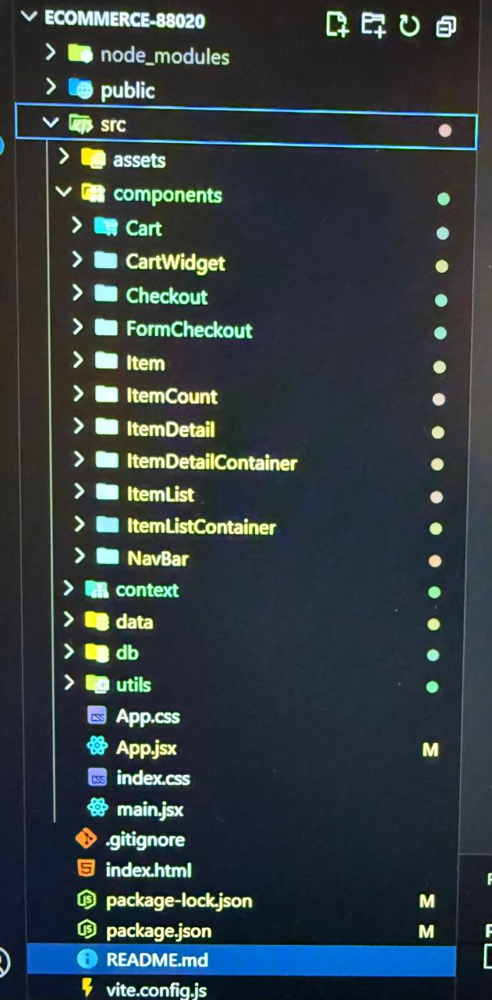

#Jessica Negri
# ProyectoFinalNegri - E-commerce de Cerámica

## Descripción
Esta es una Web App de e-commerce desarrollada con React como SPA. Permite navegar por un catálogo de productos de cerámica, ver detalles, agregar productos al carrito y finalizar compras. La app está conectada a Firebase Firestore para manejar productos y órdenes.

## Tecnologías utilizadas
- React (Componentes funcionales, Hooks, Context API)
- React Router (Navegación SPA)
- Firebase Firestore (Base de datos)
- CSS (Estilos personalizados)
- FontAwesome (Iconos)

## Estructura del proyecto

## Componentes principales
- *App.jsx*: Componente raíz con rutas y CartProvider.
- *NavBar / CartWidget*: Barra de navegación y carrito (muestra cantidad total).
- *ItemListContainer / ItemList / Item*: Listado dinámico de productos desde Firebase.
- *ItemDetailContainer / ItemDetail / ItemCount*: Detalle de productos con control de stock.
- *Cart*: Visualización de productos agregados, cantidades, subtotales y total.
- *Checkout / FormCheckout*: Formulario para finalizar compra y generar orden en Firestore.
- *CartContext.jsx*: Manejo global del estado del carrito.

## Funcionalidades implementadas
- Listado de productos desde Firebase.
- Filtro por categorías.
- Detalle de productos con validación de stock.
- Agregado de productos al carrito, actualización y eliminación.
- Visualización de carrito con subtotales, total y cantidad de productos.
- Checkout funcional que registra la orden en Firestore y devuelve ID.
- Mensajes condicionales: "carrito vacío", "producto agregado", "producto no encontrado".
- SPA sin recargar la página gracias a React Router.

## Cómo ejecutar el proyecto
1. Clonar el repositorio:

bash
## git clone <link-a-tu-repositorio>

2. Instalar dependencias:

bash
## npm install

3. Configurar Firebase en db/db.js con tus credenciales.

4. Ejecutar la app:

bash
## npm run dev

5. Abrir http://loclahost:5173 en el navegador.

## Buenas prácticas
- Código modularizado por componentes.
- Uso de Context API para manejo global del carrito.
- Separación de componentes contenedores y de presentación.
- Renderizado condicional y mensajes claros para el usuario.
- Convenciones de nombres y estructura de carpetas consistentes.